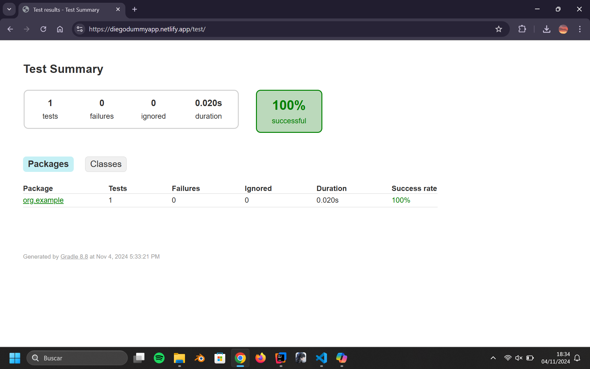

# Despliegue Documentacion

Este proyecto consiste en:

- Usar docker para crear distintos servidores que contienen: - Un reverse proxy en Nginx configurado para https. - Una página "app.com" que redirecciona a diferentes subdirectorios. - Una página que contiene la documentacion que genera Javadoc bajo el subdirectorio "/docs" en in servidor Apache. - Una página que contiene el resultado de los tests de la aplicación bajo el subdirectorio "/test" en un servidor Nginx. - Una página que contiene la documentacion generada por Jacoco con la covertura de los testa de la aplicación bajo el subdirectorio "/coverage" en un servidor Nginx.
   

### Proceso

Para realizar el trabajo primero hice un aaplicación en Java muy simple con una funcion solo y un test para dicha función.

Luego metí la página en un repositorio de Github y creé una página con Netlify con un fichero "netlify.toml" que consiste en las instruciones para el build y las redirecciones para los subdirectorios que contienen la documentacion.

Esos son:

- /tests
- /coverage
- /docs

 

### Capturas

#### diegodummyapp.netlify.app

 

#### /docs/

 

#### /coverage/

 

#### /test/

