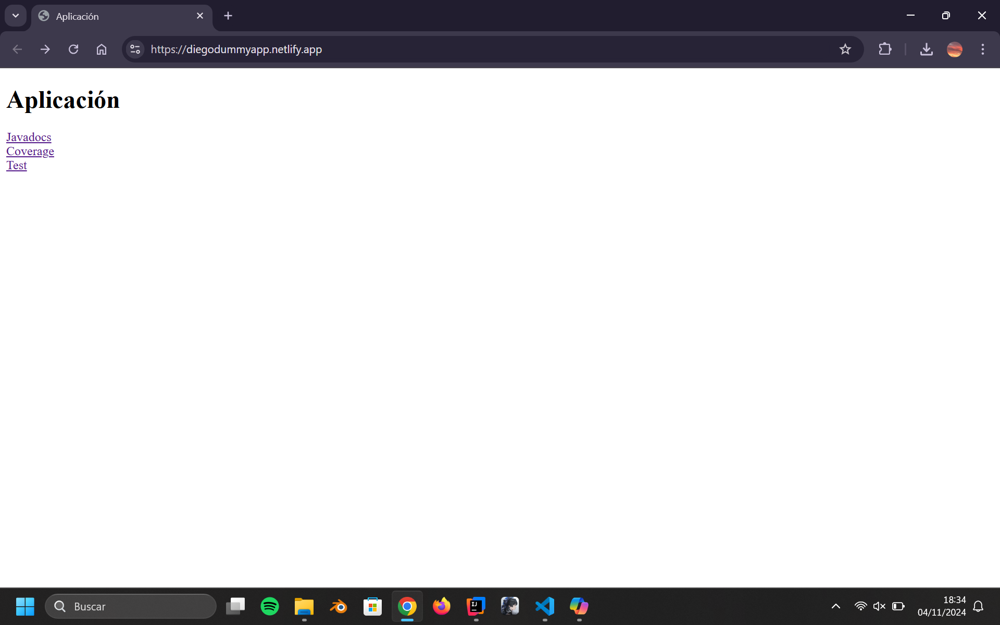
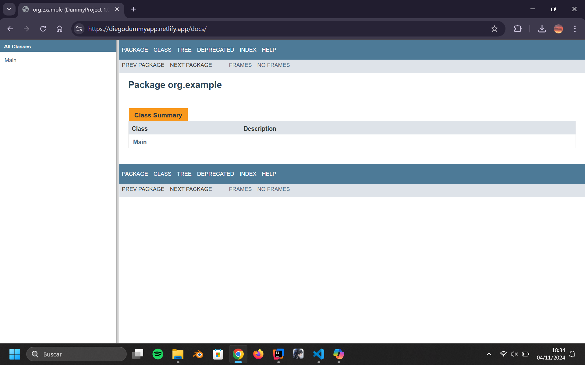
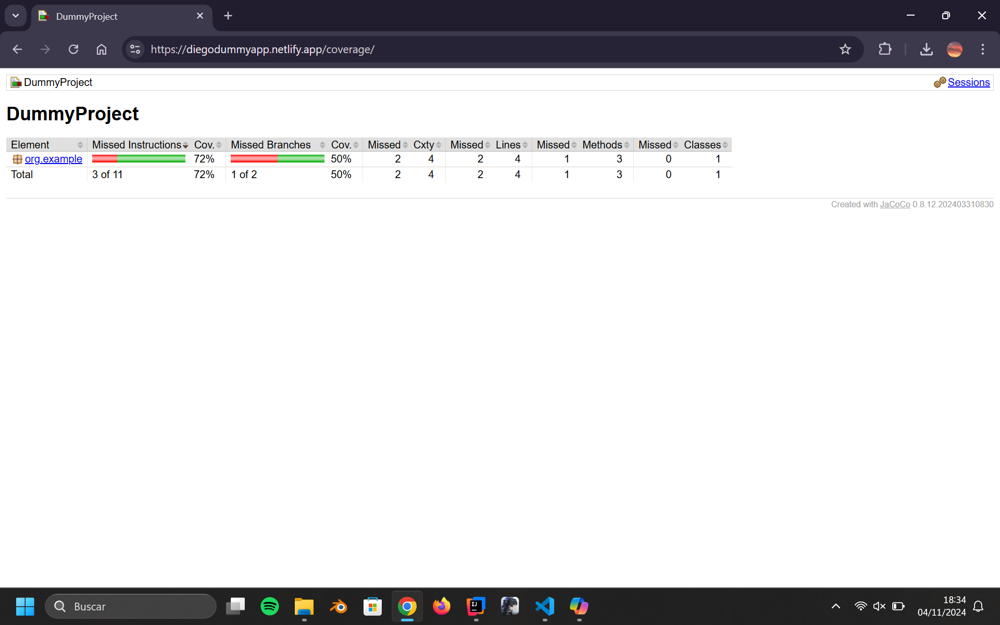
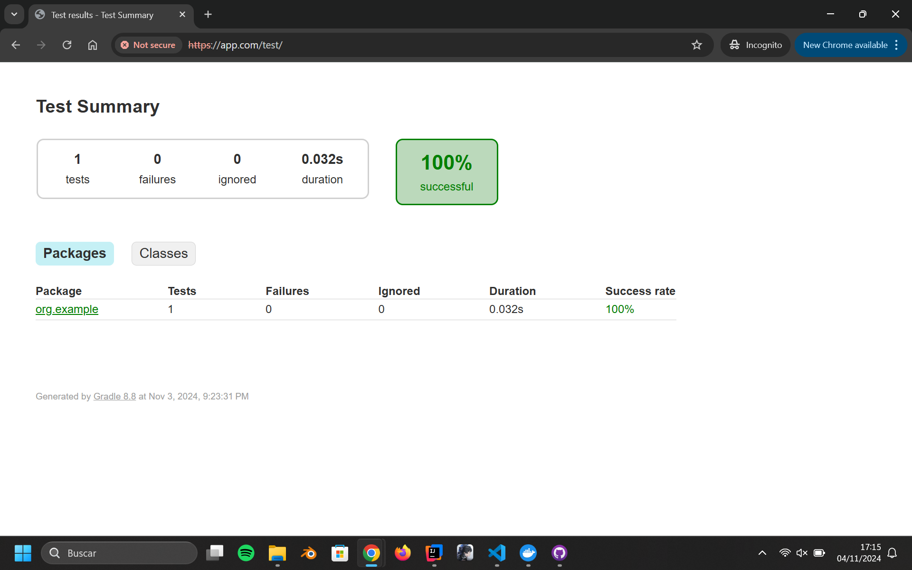

# Despliegue Documentacion

Este proyecto consiste en:

- Usar docker para crear distintos servidores que contienen: - Un reverse proxy en Nginx configurado para https. - Una página "app.com" que redirecciona a diferentes subdirectorios. - Una página que contiene la documentacion que genera Javadoc bajo el subdirectorio "/docs" en in servidor Apache. - Una página que contiene el resultado de los tests de la aplicación bajo el subdirectorio "/test" en un servidor Nginx. - Una página que contiene la documentacion generada por Jacoco con la covertura de los testa de la aplicación bajo el subdirectorio "/coverage" en un servidor Nginx.
   

### Proceso

Para realizar el trabajo primero hice un aaplicación en Java muy simple con una funcion solo y un test para dicha función.

Luego tuve que crear un Docker Compose y un Dockerfile que tiene las siguientes caracteristicas:

- Tiene un servidor para todas las páginas al igual que una en la que encuentra el jar de la aplicación.
- Usa el Dockerfile con dos fases, una de construccion "build" y otra de ejecución en el que se ejecuta la aplicación y se copian los archivos generados en la fase de construcción a diferentes carpetas para luego pasar esos ficheros a volumenes para poder montarlos a los servidores de cada página.
- Diferentes volúmenes para cada informe.
- Una network para que los contenedores se puedan comunicar entre si.
- El contenedor com el reverse proxy muestra los puertos 80 y 403 (para conexiones https)

Para cada subdirectorio tuve que configurarlos para que si se le llama sin la terminación "/subdirectorio\*" la añade para no tener problemas con los estilos ni otros links.
Todas las páginas utilizan la página por defecto de cada sevidor para no tener que habilitar otras nuevas aunqie se cambia la configuración.

El servidor proxy cambia el fichero "nginx.conf" para habilitar las diferentes páginas y redireccionar a ellas cuando se las llama.

 

### Capturas

#### app.com

 

#### app.com/docs

 

#### app.com/coverage

 

#### app.com/test

